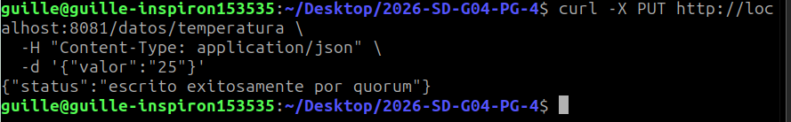
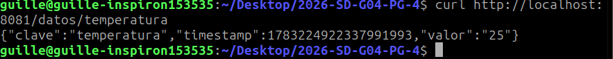
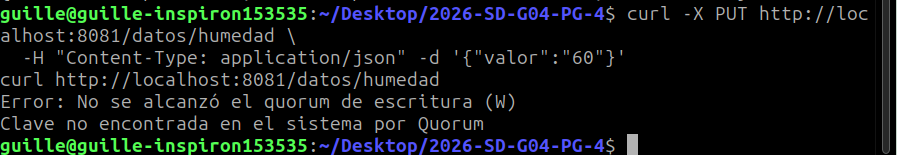
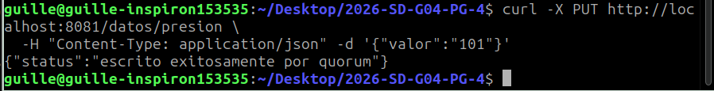
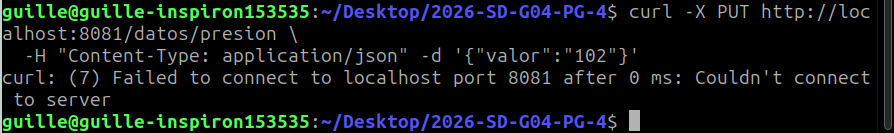

# sd-datastore

Proyecto base para la Practica Guiada 4: Replicacion con quórums + Gossip.

## Objetivo

Nodo que combina Gossip (membresía) + KV store replicado con quórums (N/W/R).

## Nota sobre la biblioteca Gossip

PG4 reutiliza `pkg/gossip` del PG3. El método `Identificarse` y los tipos `ArgsVacio`/`RespIdentificacion` son específicos de la estabilización del anillo Chord del PG3 y **no se usan en PG4**.

## Integrantes

- Gallo Guillermo Ariel
- Pedernera Theisen Nahuel Thomas

## Ejecucion

### Local (3 nodos)

```bash
# Nodo 1 (seed)
NODO_ID=1 HTTP_PORT=8080 RPC_PORT=5000 \
  PEERS=2=localhost:5001,3=localhost:5002 \
  QUORUM_N=3 QUORUM_W=2 QUORUM_R=2 \
  go run ./cmd/nodo

# Nodo 2
NODO_ID=2 HTTP_PORT=8081 RPC_PORT=5001 \
  PEERS=1=localhost:5000,3=localhost:5002 \
  SEED=localhost:5000 \
  QUORUM_N=3 QUORUM_W=2 QUORUM_R=2 \
  go run ./cmd/nodo

# Nodo 3
NODO_ID=3 HTTP_PORT=8082 RPC_PORT=5002 \
  PEERS=1=localhost:5000,2=localhost:5001 \
  SEED=localhost:5000 \
  QUORUM_N=3 QUORUM_W=2 QUORUM_R=2 \
  go run ./cmd/nodo
```

### Docker Compose (3 nodos)

```bash
make build
make run
make status
make logs
make stop
```

## Pruebas manuales

### Ver estado y convergencia Gossip

```bash
# Inmediatamente tras arrancar
curl http://localhost:8080/estado
# miembros: 1 (solo el mismo)

# Tras ~5-10 segundos (anti-entropia converge)
curl http://localhost:8080/estado
# miembros: 3 (los tres nodos se conocen)
```

### Escribir y leer con quorum (W=2, R=2)

```bash
# Escritura (quorum W=2: necesita 2 confirmaciones)
curl -X PUT http://localhost:8081/datos/temperatura \
  -H "Content-Type: application/json" \
  -d '{"valor":"25"}'

# Lectura (quorum R=2: consulta 2 réplicas y devuelve la más reciente)
curl http://localhost:8081/datos/temperatura
```

### Tolerancia a fallos (caída de 1 de 3 nodos)

```bash
# Detener el nodo 3 (Ctrl+C en su terminal, o kill del proceso)
# Con N=3 W=2 R=2, caer 1 nodo deja 2 vivos: W=2 y R=2 se cumplen.

# Escribir desde el nodo 1 — sigue funcionando
curl -X PUT http://localhost:8081/datos/humedad \
  -H "Content-Type: application/json" -d '{"valor":"60"}'
curl http://localhost:8081/datos/humedad
# Devuelve 200 con el valor.

# Si caen 2 nodos (queda 1 vivo): W=2 no se cumple
# curl devuelve 503 "quorum de escritura no alcanzado"
# curl de lectura devuelve 503 "quorum de lectura no alcanzado"
```

### Observar read-repair en logs

```bash
# 1) Escribir un valor (llega a 2 de 3 réplicas)
curl -X PUT http://localhost:8081/datos/presion \
  -H "Content-Type: application/json" -d '{"valor":"101"}'

# 2) Detener el nodo 2 (manteniendo nodos 1 y 3 vivos)
# 3) Sobrescribir el valor (solo nodos 1 y 3 lo reciben, nodo 2 no)
curl -X PUT http://localhost:8081/datos/presion \
  -H "Content-Type: application/json" -d '{"valor":"102"}'

# 4) Volver a levantar el nodo 2 (su réplica quedó con valor="101")
# 5) Leer — el coordinador detecta timestamp menor en nodo 2 y lo repara:
curl http://localhost:8081/datos/presion
# En el log del nodo 2 debería verse:
#   [STORE 2] Read-repair presion=102 (ts=...)
```

## Requisitos completados

- [x] TODO 1-11: Store local, mensajes RPC, ServicioQuorum con RPC y coordinadores (`pkg/replicacion/quorum.go`)
- [x] TODO 12-15: Nodo HTTP + RPC + anti-entropia (`cmd/nodo/main.go`)
- [x] Docker Compose con 3 nodos

## Capturas de ejecución
Para visualizar las capturas a mayor detalle, revise la carpeta "capturas" en la raíz del repositorio.

.png)

---

.png)

---



---



---



---



---




---